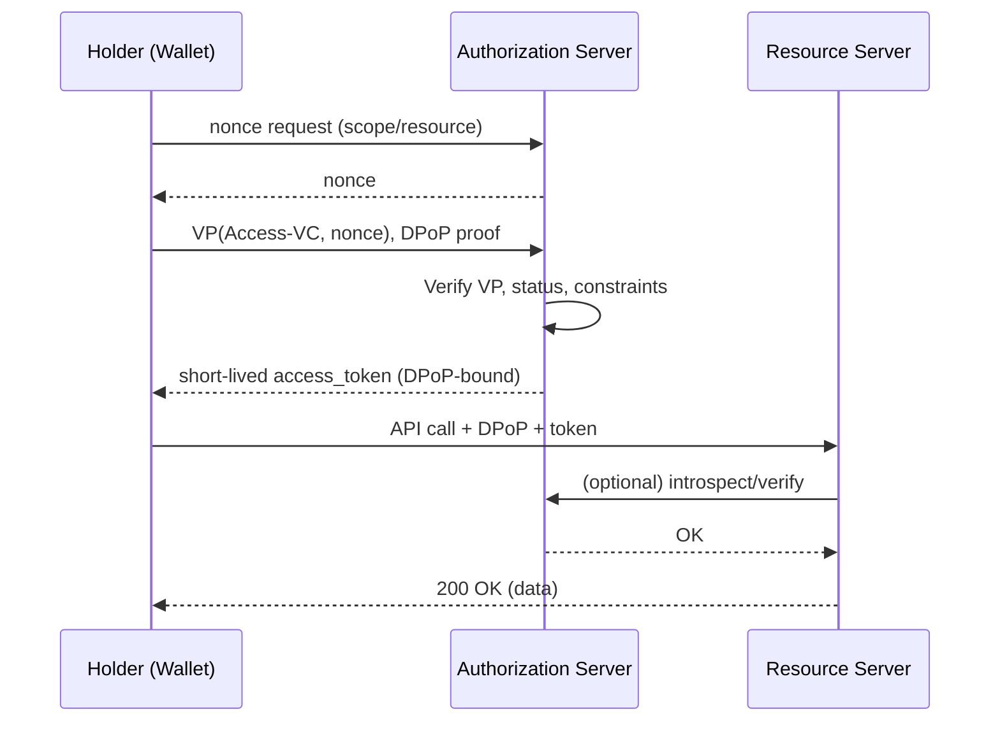

# DIDShare: A Lightweight Trust Fabric for Digital Collaboration

**Version**: 0.9 (Draft)
**Status**: Community proposal
**Audience**: Architects, CTOs, product teams, and policymakers working on EU-aligned digital collaboration

## Abstract

DIDShare is a minimalist protocol and reference architecture for working together digitally without walled gardens, heavy onboarding, or mandated stacks. Instead of creating a “dataspace” that everyone must join, DIDShare builds a thin layer of trust on top of the web by combining Decentralized Identifiers (DIDs), Verifiable Credentials (VCs), and DIDComm messaging.

Participants publish verifiable public claims (e.g., legal identity, sectoral attestations) and exchange Access-VCs to grant and delegate rights to concrete resources. Authorizations are proven through short-lived, nonce-bound Verifiable Presentations (VPs). Data can flow over anything parties already use (existing REST/GraphQL/FTP), or optionally via DSP-like negotiation patterns transported with DIDComm.

Where appropriate, DIDShare reuses what is already good: W3C DID/VC standards, common VC profiles (e.g., organization identity and business registry attributes), ODRL for usage policies, Status List for revocation, and conventional OAuth2 token patterns for bearer/DPoP-bound access. If something is heavyweight or adds little value, we leave it out.

## 1. Why this protocol now (EU context)

EU programs like DSSC and DSIC aim to stimulate cross-border, cross-sector digital collaboration with trust, sovereignty, and interoperability. In practice, many initiatives drift into complex compliance regimes and “join-the-club” ecosystems. This excludes SMEs, slows adoption, and defeats the goal of frictionless collaboration.

DIDShare’s answer:
- Open participation, no onboarding burden. Work with known parties today by exchanging DIDs and public VCs—no central registration, no gate.
- Trust, not membership. Use cryptographically verifiable credentials from sources that matter (governmental, sectoral, or bilateral).
- Protocol-agnostic data plane. Keep your existing APIs and integrations. Add trust on top; don’t rebuild your stack.
- Native delegation & events. Grant, delegate, revoke, and subscribe to updates using credentials and DIDComm.
- Portability & sovereignty. Use a portable DID method and a wallet you can migrate from SaaS to on-prem.

This aligns with EU goals—verifiability, interoperability, sovereignty—without bureaucracy.

## 2. How DIDShare works (overview)
	1.	Publish identity & trust
Each participant exposes a DID Document that includes endpoints and references to public VCs (e.g., legal identity, business registry number, sector trust VCs).
	2.	Whitelist the counterparty (optional but common)
If you already know a partner, you add their DID to your allowlist. That’s enough to start.
	3.	Grant access via an Access-VC
You issue an Access-VC to the partner, describing the resource(s), rights (read/write), optional usage constraints, validity, revocation, and whether re-delegation is allowed.
	4.	Authorize on demand with a VP (nonce-bound)
The partner’s wallet presents the Access-VC inside a Verifiable Presentation containing a nonce from your Authorization Server (AS). The AS validates the VP and issues a short-lived token, preferably DPoP-bound (or mTLS) to the holder’s key.
	5.	Call the resource with the token
The partner uses the token to access your Resource Server (RS) over your existing API. The RS verifies the token (and DPoP if used) and serves the request.
	6.	Delegation
If allowed, the partner can delegate their access by issuing a Delegation-VC that references the original Access-VC, with equal or stricter constraints.
	7.	Subscriptions & updates
Partners can subscribe to resource changes via DIDComm. When something changes, a signed resource-update DIDComm message is pushed to subscribers.
	8.	Revocation & status
Access and delegation VCs can be revoked using Status List mechanisms. Tokens are short-lived by design.

## 3. Architecture & roles

Actors
	•	Issuer – Issues VCs (identity, trust, access). Could be a company, a government, or a trust anchor.
	•	Holder/Wallet – Holds VCs, produces nonce-bound VPs, signs DIDComm messages.
	•	Verifier/Authorization Server (AS) – Verifies VPs, issues short-lived access tokens (DPoP/mTLS recommended).
	•	Resource Server (RS) – Serves protected resources; validates tokens and enforces scopes/constraints.

Core components
	•	DID Document with endpoints: didcommMessaging, authz, vcDirectory, resourceCatalog (optional).
	•	Public VC catalog – A small JSON index hosted at a well-known URL listing public verifiable credentials and metadata.
	•	Access-VC & Delegation-VC models – JSON-LD credentials capturing resource URI(s), actions, constraints, validity, and status.
	•	DIDComm message families – Minimal set for negotiation, subscription, and update notifications.

Interoperability & reuse
	•	W3C DID & VC (mandatory).
	•	VC Status List for revocation.
	•	ODRL for usage constraints, where useful.
	•	Gaia-X-style organizational attributes (optional) when a partner finds them useful.
	•	OAuth2/OIDC patterns only where they add value (e.g., token issuance), not as mandatory identity layers.
	•	DSP-like semantics may be transported via DIDComm as an option, not a requirement.

## 4. Protocol flows (high level)

### 4.1 Pairing / trust bootstrap
	1.	A discovers B’s DID (via URL, QR, email signature, catalog, etc.).
	2.	A fetches B’s DID Document and public VC catalog.
	3.	A verifies B’s public VCs (e.g., legal identity, business registry, sector trust).
	4.	(Optional) A whitelists B’s DID.

### 4.2 Granting access
	1.	A issues an Access-VC to B (Holder).
	2.	B stores it in their wallet.

### 4.3 On-demand authorization
	1.	B requests a nonce from A’s AS for a specific resource/scope.
	2.	B constructs a VP containing the Access-VC and signs it with the nonce.
	3.	AS verifies the VP and issues a short-lived, key-bound token.
	4.	B calls A’s RS with the token (+ DPoP).
	5.	RS serves the request.


### 4.4 Delegation
	•	If the Access-VC allows delegation, B issues a Delegation-VC to C referencing the original Access-VC, with equal or narrower rights/constraints.

### 4.5 Subscription & updates (DIDComm)
	•	B sends a subscription-propose DIDComm message for a resource.
	•	A replies subscription-ack.
	•	A later sends resource-update DIDComm messages when the resource changes.

### 4.6 Revocation
	•	Issuer updates the Status List for the Access-VC / Delegation-VC.
	•	AS rejects further VPs containing revoked credentials.
	•	Tokens expire quickly by default.

## 5. Data models (normative examples)

JSON shown is illustrative; contexts and types may be adapted as the community refines the vocabularies.

### 5.1 DID Document (with public VC references)
```json
{
  "@context": ["https://www.w3.org/ns/did/v1"],
  "id": "did:web:example.com",
  "verificationMethod": [{
    "id": "did:web:example.com#v1",
    "type": "Ed25519VerificationKey2020",
    "controller": "did:web:example.com",
    "publicKeyMultibase": "z6Mki...abc"
  }],
  "assertionMethod": ["did:web:example.com#v1"],
  "authentication": ["did:web:example.com#v1"],
  "service": [
    {
      "id": "did:web:example.com#didcomm",
      "type": "DIDCommMessaging",
      "serviceEndpoint": "https://example.com/didcomm"
    },
    {
      "id": "did:web:example.com#authz",
      "type": "DIDShareAuthz",
      "serviceEndpoint": "https://example.com/.well-known/didshare/authz"
    },
    {
      "id": "did:web:example.com#vc-directory",
      "type": "VCCatalog",
      "serviceEndpoint": "https://example.com/.well-known/vc-catalog.json"
    },
    {
      "id": "did:web:example.com#resource-catalog",
      "type": "ResourceCatalog",
      "serviceEndpoint": "https://api.example.com/.well-known/resources.json"
    }
  ],
  "alsoKnownAs": ["https://example.com"]
}
```
**Public VC catalog** (referenced above):

```json
{
  "issuer": "did:web:example.com",
  "credentials": [
    {
      "id": "https://example.com/vc/legal-identity.json",
      "type": ["VerifiableCredential", "LegalEntityCredential"],
      "purpose": "Legal identity / business registry (KvK)"
    },
    {
      "id": "https://example.com/vc/sector-trust.json",
      "type": ["VerifiableCredential", "SectorTrustCredential"],
      "purpose": "Sector-specific trust anchor attestation"
    }
  ]
}
```

| Best practice is to link public VCs instead of embedding them directly in the DID Document.

### 5.2 Access-VC (granting read access with constraints)

```json
{
  "@context": [
    "https://www.w3.org/ns/credentials/v2",
    "https://www.w3.org/ns/odrl.jsonld",
    "https://didshare.org/contexts/access-grant-v1.jsonld"
  ],
  "type": ["VerifiableCredential", "AccessGrantCredential"],
  "id": "urn:uuid:0e6c6f12-4a2f-4e77-b249-1e2a78c928aa",
  "issuer": "did:web:example.com",
  "issuanceDate": "2025-09-13T10:00:00Z",
  "expirationDate": "2026-03-13T10:00:00Z",
  "credentialStatus": {
    "id": "https://example.com/status/1#12345",
    "type": "StatusList2021Entry",
    "statusPurpose": "revocation",
    "statusListIndex": "12345",
    "statusListCredential": "https://example.com/status/1"
  },
  "credentialSubject": {
    "id": "did:web:partner.example.org",
    "access": [{
      "resource": "https://api.example.com/orders/*",
      "actions": ["read"],
      "conditions": {
        "odrl:constraint": [
          {
            "odrl:leftOperand": "odrl:purpose",
            "odrl:operator": "eq",
            "odrl:rightOperand": "supply-chain-ops"
          }
        ],
        "jurisdiction": "EU"
      },
      "delegation": {
        "allowed": true,
        "maxDepth": 1
      }
    }]
  },
  "proof": {
    "type": "Ed25519Signature2020",
    "created": "2025-09-13T10:00:05Z",
    "verificationMethod": "did:web:example.com#v1",
    "proofPurpose": "assertionMethod",
    "jws": "eyJ...sig"
  }
}
```
### 5.3 Delegation-VC (narrower scope, one hop)

```json
{
  "@context": [
    "https://www.w3.org/ns/credentials/v2",
    "https://didshare.org/contexts/delegation-v1.jsonld"
  ],
  "type": ["VerifiableCredential", "AccessDelegationCredential"],
  "id": "urn:uuid:6d1f5c93-10d3-4c85-9a1c-7b2bcd1f7f2a",
  "issuer": "did:web:partner.example.org",
  "issuanceDate": "2025-09-13T11:00:00Z",
  "expirationDate": "2026-03-13T10:00:00Z",
  "credentialSubject": {
    "id": "did:web:thirdparty.example.net",
    "delegates": [{
      "parentCredential": "urn:uuid:0e6c6f12-4a2f-4e77-b249-1e2a78c928aa",
      "resource": "https://api.example.com/orders/{id}",
      "actions": ["read"],
      "constraints": { "purpose": "supply-chain-ops" }
    }]
  },
  "proof": {
    "type": "Ed25519Signature2020",
    "created": "2025-09-13T11:00:05Z",
    "verificationMethod": "did:web:partner.example.org#v1",
    "proofPurpose": "assertionMethod",
    "jws": "eyJ...sig"
  }
}
```

### 5.4 DIDComm messages

**Subscribe to updates:**
```json
{
  "id": "b4c2f58f-7e83-47b2-9b7a-e0a4a5a12b6c",
  "type": "https://didshare.org/protocols/subscription/1.0/propose",
  "from": "did:web:partner.example.org",
  "to": ["did:web:example.com"],
  "body": {
    "resource": "https://api.example.com/orders/*",
    "events": ["created", "updated", "deleted"]
  },
  "attachments": [{
    "id": "vp",
    "media_type": "application/vp+ld+json",
    "data": { "json": { /* VP with Access-VC proving right to subscribe */ } }
  }]
}
```

**Resource update notification:**

```json
{
  "id": "0d1e2f3a-4455-4466-8899-aabbccddeeff",
  "type": "https://didshare.org/protocols/subscription/1.0/resource-updated",
  "from": "did:web:example.com",
  "to": ["did:web:partner.example.org"],
  "body": {
    "resource": "https://api.example.com/orders/12345",
    "event": "updated",
    "timestamp": "2025-09-13T12:14:33Z",
    "hash": "sha256-8f2b..."
  }
}
```

### 5.5 Nonce-bound VP (for token issuance)

```json
{
  "@context": ["https://www.w3.org/ns/credentials/v2"],
  "type": ["VerifiablePresentation"],
  "holder": "did:web:partner.example.org",
  "verifiableCredential": [
    { /* Access-VC as above */ }
  ],
  "proof": {
    "type": "Ed25519Signature2020",
    "created": "2025-09-13T12:00:03Z",
    "verificationMethod": "did:web:partner.example.org#v1",
    "proofPurpose": "authentication",
    "challenge": "urn:didshare:nonce:a0c7d...e9",
    "domain": "authz.example.com"
  }
}
```

## 6. Security & privacy considerations
	•	Short-lived tokens (minutes) with DPoP (or mTLS) to bind to the holder key.
	•	Nonce-bound VPs prevent replay.
	•	Selective disclosure (e.g., BBS+ or SD-JWT-VC) to minimize data exposure.
	•	Revocation via Status List; AS checks status at verification time.
	•	Least privilege—narrow resources and actions; use expiration aggressively.
	•	Auditability—optionally issue “Access Receipt VCs” or write audit events to tamper-evident logs.
	•	Key rotation—DID Documents support adding/removing verification methods.
	•	No central honeypot—trust & auth remain peer-to-peer; each party defines its own trust anchors and allowlists.

## 7. Governance & portability
	•	No mandatory central governance. Each party decides which trust anchors (issuers) they accept (e.g., government eID, sector bodies).
	•	Portable DIDs.
	•	Organizations: did:web is pragmatic (DNS-anchored).
	•	Agents/Wallets: did:jwk or did:peer for portability (easy to move from SaaS to on-prem).
	•	Migration path. Export keys/VCs from SaaS wallet, import into on-prem agent, rotate endpoints in the DID Document.

## 8. Compatibility & reuse (only where it helps)
	•	W3C DID/VC – foundational.
	•	VC Status List – revocation at scale.
	•	ODRL – usage policy vocabulary (optional).
	•	Organizational attribute profiles – reuse attributes similar to Gaia-X Self-Descriptions where helpful (legal identity, service metadata).
	•	DSP-like semantics – if two parties prefer a “contract negotiation” flow, carry those semantics over DIDComm messages; no IDS connector required.
	•	OAuth2/OIDC – reuse familiar patterns at the AS layer to issue tokens once a VP is verified; implementers can integrate with existing API gateways.

## 9. Reference implementation notes (SaaS or on-prem)
	•	Wallet/Agent
	•	Key management (WebAuthn/HSM optional), DID creation (did:jwk/did:peer), VC storage (encrypted).
	•	Presentation builder (nonce-bound), DIDComm capability.
	•	Authorization Server (AS)
	•	VP verification (signature, status, constraints).
	•	Token service (JWT, DPoP recommended; mTLS optional).
	•	Policy engine: map Access-VC claims → API scopes/paths/claims.
	•	Resource Server (RS)
	•	Token verification (sig/DPoP), scope enforcement, audit logging.
	•	VC Issuer
	•	Issues Access-VCs and Delegation-VCs; maintains Status List.

## 10. Minimal conformance (MVP)
	1.	DID Document with didcommMessaging and authz endpoints.
	2.	Public VC catalog (at a well-known URL).
	3.	Access-VC JSON-LD model with resource, actions, validity, status.
	4.	Nonce-bound VP for AS verification.
	5.	Short-lived tokens (preferably DPoP-bound).
	6.	Basic DIDComm messages for subscription (propose, ack, `resource-updated
